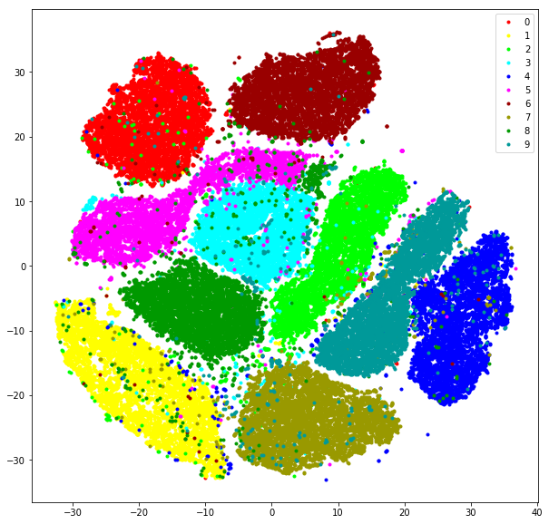
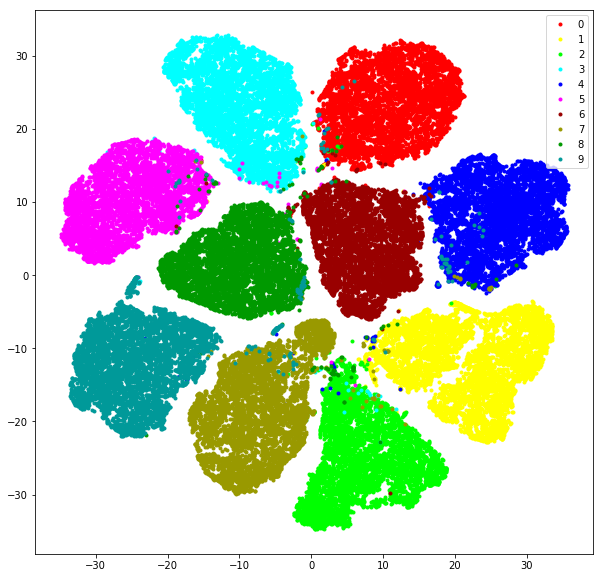

# mnist_tsne
t-sne visualization of mnist images when feature is represented by raw pixels and cnn learned feature

# something to say
- the training code is from [pytorch mnist example](https://github.com/pytorch/examples/tree/master/mnist). The accuracy is 98% when use the original code, when bn is used in convolution and fully connected layer, the accuracy is 99. The training code here is with bn.
- the code for t-sne visualization is from [danielfrg/tsne](https://github.com/danielfrg/tsne)
- you can find the original mnist train raw data(60000x784), lable(60000x1), cnn learned feature(60000x50), t-sne generated feature(60000x2) for raw data and cnn learned feature, trained model in [Baidu Pan](https://pan.baidu.com/s/1ESrfqb4Jn8-4c3wmGWcyCw) or [Google Drive](https://drive.google.com/drive/folders/1fe20AhrNj1sHMlyiTOlpUrMBPpvbc6Jn?usp=sharing)
- tsne_vis.ipynb is used to do tsne and visualization

# visualization
|  | |
|:---:|:---:|
|*t-sne of raw image pixel*|*t-sne of cnn learned feature*|

from above visualization, it is shown that t-sne of cnn learned feature is **more centered** and **cleaner** than that of t-sne of raw image pixel 
